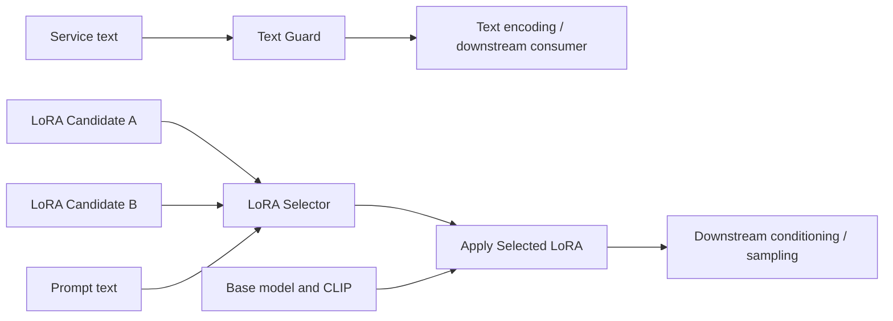

# TypeSafe visual decision nodes — technical design

> Baseline design imported from the ComfyUI workspace. Host-code references below are pinned to the tested backend revision. Implementation progress is tracked in the adjacent issues directory.

Status: proposed implementation specification. Date: 2026-09-26.

This document specifies a standalone ComfyUI custom-node package. It supersedes
the preliminary scaffold in `custom_nodes/comfyui-typesafe`, which has not been
validated and does not implement this design. This specification does not imply
that the nodes are implemented or tested.

## 1. Outcomes and scope

The user configures decisions through visual nodes and ordinary widgets, without
editing JSON or Python. The first release provides four nodes:

1. **Text Guard:** inspect text, stop the current prompt when a condition holds,
   otherwise pass the text through unchanged.
2. **LoRA Candidate:** describe one installed LoRA and its application settings.
3. **LoRA Selector:** choose exactly one connected candidate or none.
4. **Apply Selected LoRA:** apply the selection, or pass through unchanged.

The selector must never blend candidates or silently select a fallback candidate.
An API failure is an error, not a valid none selection. Candidate creation and
LoRA application do not call TypeSafe.

Deferred: generic Choice/Score nodes, a standalone Text Judgment node, arbitrary
branch routing, fallback services, retries of upstream workflow nodes, candidate
catalog files, multiple LoRA selection, automatic compatibility detection,
automatic trigger-word insertion, and custom frontend JavaScript.

## 2. Design decisions

| Concern | Decision | Reason |
| --- | --- | --- |
| Node framework | ComfyUI V3 `ComfyExtension` and `io.ComfyNode` | Matches the repository's current example and supports native custom sockets and growing inputs |
| Candidate wiring | Native `io.Autogrow`, 1–100 connected candidate inputs | Visual configuration without a merge node or frontend extension; local implementation caps growing inputs at 100 |
| Selection | One TypeSafe Choice over candidates plus explicit none | A bounded choice; filenames and settings remain controlled by code |
| Guard | One TypeSafe Noul and a deterministic threshold rule | Separates semantic judgment from execution policy |
| Network | Async HTTP adapter using ComfyUI's existing `aiohttp` dependency | Small integration surface, cancellation, no new SDK dependency |
| Loading | Adapter delegating to ComfyUI's existing `LoraLoader` | Reuses path resolution, safe weight loading, and model patching |
| Runtime values | Immutable typed records on namespaced custom sockets | Keeps the chosen filename, strengths and triggers together |
| Credentials | Server environment only | No key widgets or credentials in workflow exports |
| Failure policy | Stop on configuration, transport, protocol or loading errors | A missing judgment must not masquerade as a successful decision |

Target the installed ComfyUI revision initially. Record the exact tested backend
and frontend versions in the package README before release; do not claim support
for every historical ComfyUI release. The growing-input UI requires a browser
smoke test even though backend support exists.

## 3. Workflow topology



For a combined workflow, connect the guard's passed text to the selector and text
encoder. This makes both depend on a successful guard. The base checkpoint may
load independently; this design does not prevent all upstream or parallel work.

Candidates carry metadata only. They never load weights. All candidate nodes can
execute cheaply; the Apply node loads at most one LoRA. Lazy branch evaluation is
therefore unnecessary for this release.

## 4. Node contracts

Use category `TypeSafe` and stable node IDs below. Text inputs are connectable
strings with multiline widgets, allowing standalone experiments and linked text.
All numeric constraints are validated server-side as well as in widgets.

### 4.1 Text Guard — `TypeSafeTextGuard`

| Input | Type | Default / behaviour |
| --- | --- | --- |
| text | STRING | Required source text; blank/whitespace-only input is a configuration error |
| condition | STRING | Editable question: “Does the text report that the service failed to produce a usable result?” |
| stop_threshold | FLOAT | 0.5, inclusive range 0–1 |
| model | STRING | `jev-latest`; advanced widget, may use an explicit provider model ID |
| refresh_id | INT | 0; changing it requests a fresh judgment for unchanged inputs |

Successful outputs: `text: STRING`, `condition_probability: FLOAT`,
`decision_details: STRING` (formatted JSON suitable for a text viewer).

Policy: stop when `probability >= stop_threshold`; otherwise return the original
text byte-for-byte. The default condition's question explains that actual error,
timeout, or unavailability messages count, while successful content merely
discussing failures does not. Other conditions remain usable by editing the widget.

The module raises a dedicated `GuardRejected` error containing the probability and
threshold, not the input text. ComfyUI reports an execution error and stops further
scheduling for the current prompt. This is an intentional visible stop, not a
global interrupt. It does not clear queued prompts, undo prior work, guarantee
cancellation of already-running independent nodes, or stop another user's work.

A rejected execution has no normal output values. The error carries the decision
summary; the UI must not promise probability outputs from a stopped node.

The first release uses one threshold. Around 0.5 the model is uncertain, and the
configured comparison still determines the action. A separate uncertainty band
is deferred. Defaults are starting settings, not calibrated accuracy guarantees.

### 4.2 LoRA Candidate — `TypeSafeLoraCandidate`

| Input | Type | Default / behaviour |
| --- | --- | --- |
| lora_name | COMBO | Exact installed name from `folder_paths.get_filename_list("loras")` |
| description | STRING | Required nonblank description of when this candidate is appropriate |
| strength_model | FLOAT | 1.0; finite, −100 to 100, matching the core loader |
| strength_clip | FLOAT | 1.0; finite, −100 to 100 |
| trigger_words | STRING | Empty by default; copied verbatim, never generated |

Output: `candidate: TYPESAFE_LORA_CANDIDATE`.

Validate membership in the installed LoRA list when executing. If no LoRAs exist,
show a clear setup error; never interpret a placeholder entry as a real filename.
Use relative names from ComfyUI, including subdirectories; never accept arbitrary
absolute paths or paths returned by TypeSafe.

The user must connect candidates compatible with the base model. Descriptions can
explain intended usage, but semantic selection does not establish tensor or model
architecture compatibility. Core loading warnings/errors remain visible.

### 4.3 LoRA Selector — `TypeSafeLoraSelect`

| Input | Type | Default / behaviour |
| --- | --- | --- |
| text | STRING | Required nonblank selection context |
| candidates | Autogrow of TYPESAFE_LORA_CANDIDATE | 1–100 connected inputs |
| min_confidence | FLOAT | 0.5, inclusive range 0–1 |
| model | STRING | `jev-latest`; advanced widget |
| refresh_id | INT | 0 |

Outputs:

- `selection: TYPESAFE_LORA_SELECTION` — authoritative value for the Apply node.
- `lora_name: STRING` — accepted filename, or empty for none.
- `has_match: BOOLEAN` — true only when a candidate is accepted.
- `confidence: FLOAT` — raw Choice confidence, including when none is returned.
- `trigger_words: STRING` — selected candidate's text, or empty for none.
- `decision_details: STRING` — raw winner, probabilities and effective outcome.

Reject duplicate installed filenames rather than creating competing entries for
the same LoRA. Reject missing files before inference. Order sockets by numeric
suffix rather than lexicographically (`candidate2` precedes `candidate10`). Map
them to request-local IDs such as `candidate_0`; reserve `none` internally.

Decision order is exact:

1. Validate the provider answer and all probabilities.
2. If the raw winner is `none`, return none with reason `no_match`.
3. If its confidence is less than `min_confidence`, return none with reason
   `low_confidence`.
4. Otherwise return the corresponding candidate with reason `selected`.

Equality at the threshold is accepted. Exact ties for the maximum probability
are treated as none with reason `ambiguous`, even if the threshold is zero; this
check precedes steps 2–4. Do not break ties using socket order. Numerical
near-ties remain governed by the provider confidence and configured threshold.

Never choose the runner-up because the winner became unavailable. A stale accepted
file is an error at application time. The Apply node does not reinterpret the
selector's decision.

### 4.4 Apply Selected LoRA — `TypeSafeLoraApply`

Inputs: `model: MODEL`, `clip: CLIP`,
`selection: TYPESAFE_LORA_SELECTION`. Outputs: `model: MODEL`, `clip: CLIP`.

For none, return the exact input objects and perform no file read or patching.
For a selected candidate, resolve its installed name again and delegate to the
core loader using the candidate's strengths. A zero-strength selection remains
a valid selection and follows the core loader's zero-strength behaviour.

Trigger words are deliberately a selector output, not a mutation of any prompt.
Users connect them through ordinary text composition nodes if desired. Required
CLIP matches the standard loader for this release; a model-only variant can be
added later using the same application module.

## 5. Modules and interfaces

```text
ComfyUI node adapters
   ├── DecisionEngine ── JudgmentGateway ── TypeSafeHttpGateway
   │         └── pure question builders and decision rules
   └── LoraRuntime ── ComfyLoraRuntime
```

The composition root creates dependencies. Node adapters translate widgets and
sockets into domain records, call a module, and translate results back. They do
not construct HTTP requests, parse provider JSON, or implement threshold rules.

### Domain records

Use frozen dataclasses with tuple-based collections; do not expose mutable
dictionaries inside otherwise frozen records.

```python
LoraCandidate(name, description, strength_model, strength_clip, trigger_words)
NoulJudgment(probability, metadata)
ChoiceJudgment(winner_id, probabilities, confidence, metadata)
LoraSelection(candidate_or_none, reason, raw_judgment)
GuardDecision(should_stop, probability, threshold, metadata)
DecisionMetadata(requested_model, returned_model, input_tokens, output_tokens)
```

These are conceptual interfaces, not complete code declarations. `probabilities`
is an immutable sequence of `(option_id, probability)` pairs. The internal absence
value is Python `None`, never an empty filename sentinel. Empty strings are only
presentation outputs. Socket type strings are namespaced; runtime record
validation still applies because socket names alone are not a security or typing
guarantee. Runtime records are not serialized into workflow JSON.

### DecisionEngine

Public interface:

```python
async judge_guard(text, condition, threshold, model) -> GuardDecision
async select_lora(text, candidates, min_confidence, model) -> LoraSelection
```

Hides question construction, stable option mapping, semantic result validation,
and deterministic decision policy. It receives a `JudgmentGateway` dependency.
It neither imports ComfyUI nor loads files. It returns decisions; the node adapter
turns `should_stop` into an execution error.

### JudgmentGateway

One async method: `evaluate(state, question, model) -> Judgment` where Question
and Judgment are closed typed unions for Noul and Choice. The production HTTP
adapter and an in-memory fake are the two implementations of this seam. Do not
expose arbitrary HTTP details or unvalidated dictionaries to the engine.

### LoraRuntime

Interface: list installed names, validate a candidate's file, obtain a file
fingerprint, and apply one accepted candidate to model/CLIP. A production adapter
uses `folder_paths` and core `LoraLoader`; a fake records load operations and
returns sentinel models for tests. File availability and loading policy stay here.

### SOLID and DRY application

| Principle | Concrete constraint |
| --- | --- |
| Single responsibility | Nodes handle ComfyUI adaptation; engine owns decisions; gateway owns provider interaction; runtime owns LoRA access |
| Open/closed | A future judgment node reuses the gateway; a future model-only Apply node reuses the runtime; no generic plugin framework is introduced |
| Liskov substitution | Fake and production adapters return the same validated records and error categories; neither converts errors into negative judgments |
| Interface segregation | Decision callers never require filesystem/model-loading methods; application callers never require inference methods |
| Dependency inversion | Engine depends on the small gateway protocol; ComfyUI and HTTP dependencies enter at the composition root |
| DRY | One probability validator, one provider parser, one question builder per judgment, one policy implementation per outcome, one file resolver |

Use composition, not a Guard subclass of a Judgment node. Sharing a few widget
definitions does not justify a node inheritance hierarchy. Extract schema helpers
only for genuinely identical fields. Do not merge the distinct meanings of Noul
probability, Choice confidence, and selected-option probability into one score.

## 6. TypeSafe integration contract

The provider adapter uses `POST https://api.typesafe.ai/v1/systemone`, a Bearer key,
and the documented state/model/questions envelope. Each execution sends one
question with a stable internal question ID. The transport retains returned model
and token usage in metadata. [HTTP reference](https://docs.typesafe.ai/api)

The guard sends `{text: ...}` as state and a Noul question about the configured
condition. The selector sends the text and candidate descriptions as structured
context with a Choice rubric that includes none. State is evidence, not instructions.
Only filenames/descriptions needed for selection are sent; local paths, model
tensors, strength settings, and credentials are not part of semantic state.

The adapter validates answer type, expected IDs, finite probabilities in [0,1],
complete option coverage, total probability within 0.01 of 1, and a winner whose
probability is maximal (allowing 1e-6 numeric tolerance). Reject malformed,
unknown-option or nonfinite responses. Never silently normalize an invalid
distribution or parse a generated filename as a selection.

Noul's value is probability of yes, with no separate confidence. Choice confidence
summarizes its distribution; it does not establish compatibility or overall
correctness. The selector retains both confidence and option probabilities for
inspection. [Noul](https://docs.typesafe.ai/primitives/noul),
[Choice](https://docs.typesafe.ai/primitives/choice),
[confidence](https://docs.typesafe.ai/confidence)

This follows the bounded-selection pattern: the model selects an ID, then code
copies known settings. [Function-calling cookbook](https://docs.typesafe.ai/cookbooks/function_calling)

### Transport lifecycle and errors

- Read `TYPESAFE_API_KEY` server-side when creating a request. Missing credentials
  do not prevent ComfyUI startup or metadata-only candidate nodes from working.
- Use an async context-managed HTTP session per evaluation initially. No global
  event-loop-bound session or import-time network activity.
- Default overall evaluation deadline: 30 seconds, including backoff and reading.
  Permit a server environment setting from 1–120 seconds. No separate connect
  timeout: connecting can stall for seconds while ComfyUI loads or runs a model.
- At most two attempts, retrying only explicit HTTP 429 and 529 responses.
  Respect a valid `Retry-After` when it fits the remaining deadline; otherwise fail.
  Without it use a short jittered backoff. Do not retry authentication, validation,
  connection ambiguity, timeout, or malformed-success errors automatically.
- Disable redirects; never forward the Bearer key to a redirect target. Use TLS
  verification and the fixed provider host. Limit response bodies to 1 MiB.
- Propagate async cancellation and close the response/session. Do not swallow
  cancellation under generic exception handling. Verify actual ComfyUI interrupt
  behaviour; the deadline bounds a request if the host does not cancel it promptly.
- Map errors to `ConfigurationError`, `ProviderUnavailable`, `ProviderProtocolError`,
  `GuardRejected`, or `LoraApplicationError`, with actionable sanitized messages.

The package does not log input text, credentials, raw provider bodies or headers.
ComfyUI itself can include node inputs in execution error details; the package
must document that limitation rather than claim end-to-end redaction. Workflow
text and candidate descriptions are sent to TypeSafe when inference executes.

## 7. Caching and reproducibility

Use ComfyUI's normal output cache, with explicit fingerprints where external files
matter. Do not add a second inference cache in this release.

- Text Guard and Selector reuse successful outputs while inputs are unchanged.
  `refresh_id` is a cache-busting input, not a random seed for TypeSafe.
- Changing a threshold reruns the inference node in V1. The internal decision
  rules remain pure, but reuse across threshold changes is deferred to a later
  separate Judgment/Policy node design.
- Changing text, condition, descriptions, strengths, triggers or model invalidates
  the relevant node through normal input tracking. The latter metadata changes
  may cause unnecessary inference in V1; accept that instead of adding a cache.
- Candidate and Apply fingerprints include resolved file identity, size and
  nanosecond mtime so ordinary replacement/removal invalidates stale outputs.
  Apply fingerprints inspect the selected candidate; none needs no file access.
- If retaining a core `LoraLoader` instance, invalidate its internal weight cache
  when the file fingerprint changes. Initial implementation may instantiate it
  per Apply execution to avoid a competing cache lifecycle.
- File metadata is not a cryptographic identity guarantee. Replacing a file while
  preserving size and timestamp requires refresh/restart; do not promise content
  hashing without implementing it.
- `jev-latest` can change remotely without input changes. For reproducible runs,
  use a pinned model ID, save decision details, and control refresh explicitly.

No synchronous HTTP call may block ComfyUI's event loop. Deterministic nodes remain
synchronous. Candidate inputs are aggregate metadata, not ComfyUI batch lists;
verify Autogrow input packing and normal mapped execution separately.

## 8. Package layout

```text
custom_nodes/comfyui-typesafe/
  __init__.py                 # V3 extension registration / composition root
  nodes.py                    # Four ComfyUI adapters and schemas
  domain.py                   # Immutable records and invariants
  decisions.py                # Engine, question builders, pure policies
  gateway.py                  # Gateway protocol and HTTP implementation
  lora_runtime.py             # Runtime protocol and ComfyUI implementation
  errors.py                   # Shared error taxonomy
  README.md                   # Setup, wiring, limits, tested versions
  pyproject.toml              # Package metadata and development test dependencies
  examples/                  # Exported, verified visual workflows
  tests/                     # Unit, adapter contract and host integration tests
```

Prefer this small module set to a directory per class. V1 does not require a web
extension, a database, a dependency-injection framework, or changes to ComfyUI core.
The host repository ignores `custom_nodes/`; distribute/version the package in a
standalone repository when preparing it for release. This spec stays in the host's
tracked `design/` directory. No Git repository creation is part of this design task.

## 9. Validation and acceptance criteria

Tests exercise the same module interfaces used by node adapters. Use a fake
gateway for deterministic application tests and a local HTTP test server for
transport contract tests. Never require paid inference for ordinary test runs.

| Area | Required evidence |
| --- | --- |
| Guard policy | Below/equal/above threshold; original text preserved; rejected execution prevents a dependent sentinel node from executing |
| Selection | Clear winner; explicit none; low confidence; equality; exact tie; single candidate; 100 candidates; zero candidates rejected |
| Candidate validation | Duplicate names, blank descriptions, missing files, finite strengths and valid ranges; numeric socket ordering |
| Provider contract | Valid Noul/Choice fixtures; missing/extra option IDs; wrong type; unknown winner; NaN/infinity; invalid sum; nonmaximal winner |
| Transport | Missing key; 401/422; bounded 429/529 retries; retry deadline; oversized body; invalid JSON; redirect refusal; timeout and cancellation cleanup |
| Application | None returns identical objects without loader invocation; selected candidate invokes loader once with exact settings; no-match triggers empty; stale file raises |
| Caching | Identical successful run reuses result; refresh and model changes rerun; file replacement/removal invalidates candidate/application; no stale loader cache |
| ComfyUI integration | Extension imports/registers; schemas validate; custom sockets connect; Autogrow expands and round-trips through workflow save/load; diagnostics display |
| Example workflows | Guard wired ahead of an expensive dependent node; two visual candidates feeding selector and Apply; none path produces an unchanged base model |

Semantic quality needs a separate opt-in live evaluation set: actual service
failures, successful outputs discussing failures, ambiguous/empty responses,
irrelevant prompts, overlapping LoRA descriptions, and text attempting to override
the instructions. Record raw judgments, expected outcome, latency and token use.
Measure false stops and missed failures separately; for selection measure wrong
matches and abstentions. Tune thresholds on these examples, not mock probabilities.
Do not claim accuracy or choose release quality targets without representative data.

Completion requires offline tests and host smoke tests to pass. Live model quality
remains explicitly unverified until credentials and representative examples are
available. A passing HTTP fixture test is not a live API or model-quality test.

## 10. Implementation sequence

1. Replace the unvalidated scaffold with domain records, protocols and pure rules.
2. Implement and contract-test the HTTP adapter with sanitized failure handling.
3. Implement Candidate, Selector and Guard using native V3 schemas and growing inputs.
4. Implement Apply using the existing loader; verify none and cache invalidation.
5. Export two visual example workflows and perform browser/host smoke tests.
6. Document setup and supported versions; run opt-in live evaluation when configured.

No further product decision is required to begin this scope. Remaining empirical
questions are frontend Autogrow behaviour, host cancellation timing, and thresholds
appropriate to the user's real texts and LoRA descriptions.

## 11. Local implementation references

- [`custom_nodes/example_node.py.example`](https://github.com/Comfy-Org/ComfyUI/blob/3c1a1a2df82fc6c7aa20a3c8301d1c632e1a1d87/custom_nodes/example_node.py.example): V3 extension example.
- [`comfy_api/latest/_io.py`](https://github.com/Comfy-Org/ComfyUI/blob/3c1a1a2df82fc6c7aa20a3c8301d1c632e1a1d87/comfy_api/latest/_io.py): custom types, Autogrow (100-input cap), fingerprint interface.
- [`comfy_extras/nodes_logic.py`](https://github.com/Comfy-Org/ComfyUI/blob/3c1a1a2df82fc6c7aa20a3c8301d1c632e1a1d87/comfy_extras/nodes_logic.py): growing-input schema and packed dictionary examples.
- [`nodes.py`](https://github.com/Comfy-Org/ComfyUI/blob/3c1a1a2df82fc6c7aa20a3c8301d1c632e1a1d87/nodes.py): standard LoRA loader and model-only variant.
- [`execution.py`](https://github.com/Comfy-Org/ComfyUI/blob/3c1a1a2df82fc6c7aa20a3c8301d1c632e1a1d87/execution.py): async node execution, error reporting and prompt scheduling termination.
- [`requirements.txt`](https://github.com/Comfy-Org/ComfyUI/blob/3c1a1a2df82fc6c7aa20a3c8301d1c632e1a1d87/requirements.txt): existing aiohttp dependency.
